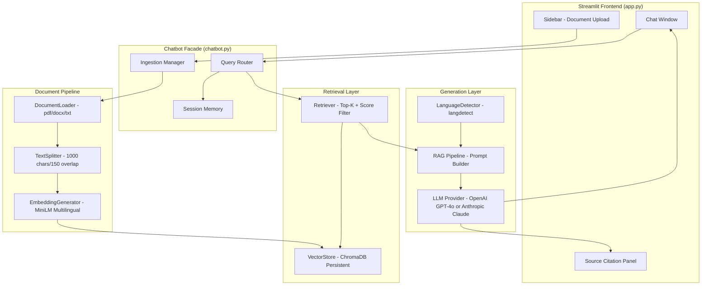
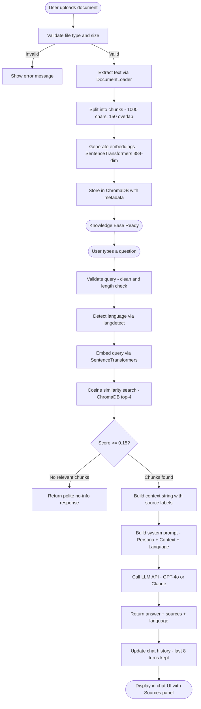
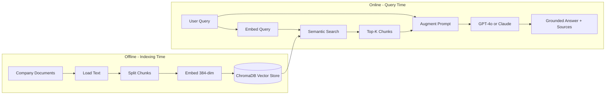
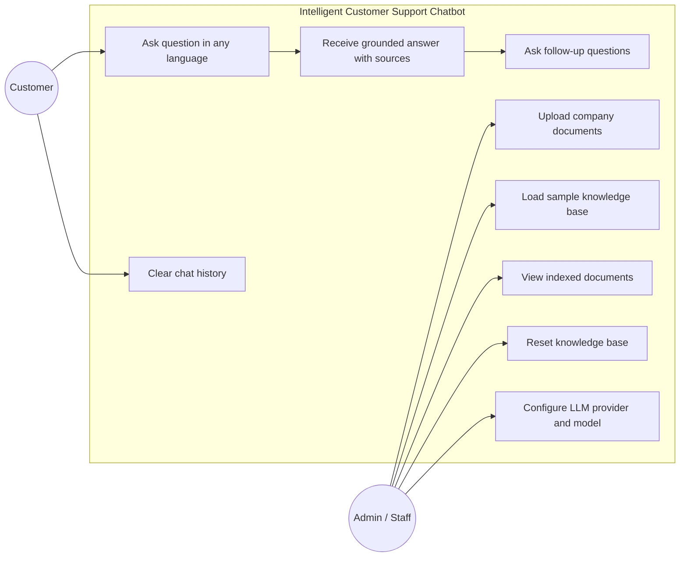
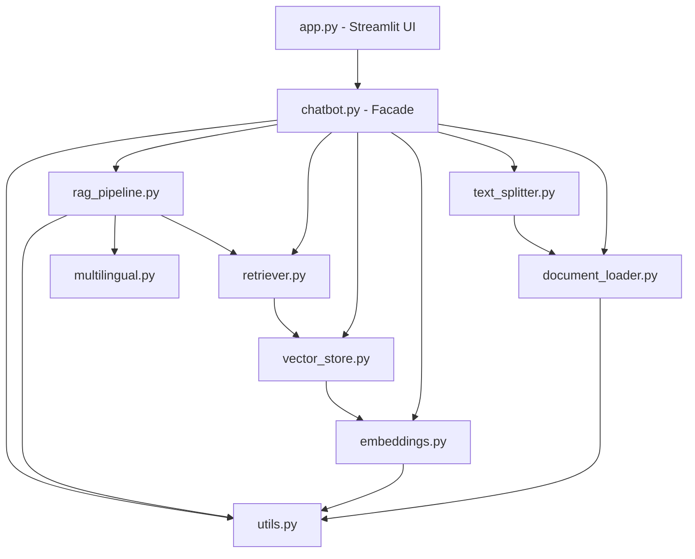
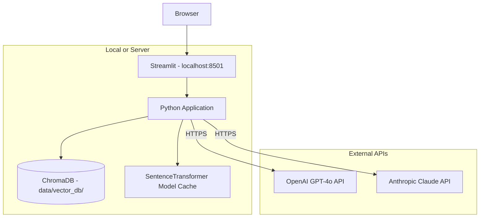

# Architecture Documentation — Intelligent Customer Support Chatbot

---

## 1. System Overview

This chatbot uses **Retrieval-Augmented Generation (RAG)** to answer customer queries
using only information from uploaded company documents — eliminating hallucination
and ensuring every answer is traceable to a source.

---

## 2. High-Level Architecture Diagram

---

## 3. Data Flow Diagram

---

## 4. RAG Architecture Diagram

---

## 5. Use Case Diagram

---

## 6. Component Dependency Diagram

---

## 7. Deployment Architecture

---

## 8. Key Design Decisions

| Decision | Choice | Reason |
|----------|--------|--------|
| Embedding model | paraphrase-multilingual-MiniLM-L12-v2 | Free, offline, 50+ languages, fast on CPU |
| Vector DB | ChromaDB (persistent) | Zero-config, embedded, survives restarts |
| Chunk size | 1000 chars / 150 overlap | Balances retrieval precision vs. context richness |
| Score threshold | 0.15 cosine similarity | Filters noise without being too restrictive |
| History limit | Last 8 turns | Supports follow-ups without excessive token usage |
| Temperature | 0.3 | Factual consistency over creativity |
| LLM provider | Configurable via .env | Swap OpenAI ↔ Anthropic with one env change |
